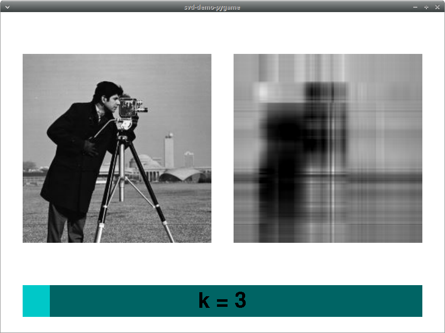

# svd-demo-ui
Experiment at runtime image compression with the SVD algorithm


## Program description
The requested program takes as input an image, transforms it into a black and white image and then shows the following window


where:
  * the left view is the original image
  * the center view is obtained from the [svd decomposition](https://en.wikipedia.org/wiki/Singular_value_decomposition) of the input, taking only the first $k$ singular values
  * the right view is the plot of explained variance as a function of $k$
  * the bottom view is the slider that controls how $k$ changes

If the user doesn't upload any image, a default one will be chosen.


## Rationale
> TL;DR Find a replacement of matplotlib for ugly but usable (=fast) interactive plots

I proposed this experiment to explore how we could interact with scientific plots and simulations. The scientific workflow benefits from interactivity for:
  * data exploration
  * building intuition
  * seeing in real time the effects of parameters for the target simulation

when searching for solutions to satisfy this requirement one must consider:
  * **quality of the plot**: as we are spoiled by `matplotlib` beautiful plots, competing solutions may have a more spartan outlook
  * **ease of use**: how easy is to assemble views and UI elements to match the user expectations
  * **low-noise rendering library**

the last point stresses the importance of making the simulation code the most relevant part of the program. The opposite of that is to bury the domain logic in deeply nested class hierarchies or in hundres of lines of UI spaghetti code. More details on the elements of a good UI solution [at my zettlekasten entry](./resources/ui.md).


## Proposed solutions
Working with python, an high level language suitable for scientific computing, I propose three demos:
  * `svd_demo_reference` implements the specification with `matplotlib` and it's considered the gold standard for looks and usability
  * `svd_demo_vispy` uses the promising [Vispy](https://vispy.org) library that uses OpenGL acceleration for plots and [PyQt5](https://pypi.org/project/PyQt5/) for UI elements
  * `svd_demo_pygame` uses the [pygame](https://pygame.org) and implements a simple UI from scratch, without plotting capabilities for now


All the programs share the same interface
```
usage: svd-demo-ui (version ...) [-h] [--image IMAGE]
                                        [--max-singular-values MAX_SINGULAR_VALUES]
                                        [--fp32 | --fp64]

Performs image compression using the SVD algorithm, let's the user decide how many singular
values in the final image

options:
  -h, --help            show this help message and exit
  --image IMAGE         Image file to be processed
  --max-singular-values MAX_SINGULAR_VALUES
                        Maximum number of singular values for compression (>2)
  --fp32                Performs the computation in float32
  --fp64                Performs the computation in float64 (default)

Click on the slider and see the effect!
```


## Screenshots

### matplotlib


### vispy
The explained variance plot has some issues I couldn't solve.


### pygame



## Final considerations
I was impressed by the Vispy + PyQt5 combination and I'm eager to apply it for a new project. However the line plot was not very good (maybe I didn't understood it properly) as it drew a bunch of points and not a continuous line.

I particularly like the structure of the Vispy stack:
  * gloo: is the object oriented interface to OpenGL
  * scene: is the building block of plots and handles views and rudimentary plots
  * plotting: provides the high level plotting interface

Is it possible to use other UI libraries and still interface with Vispy? I was thinking about some immediate mode UI libraries. It would be cool
